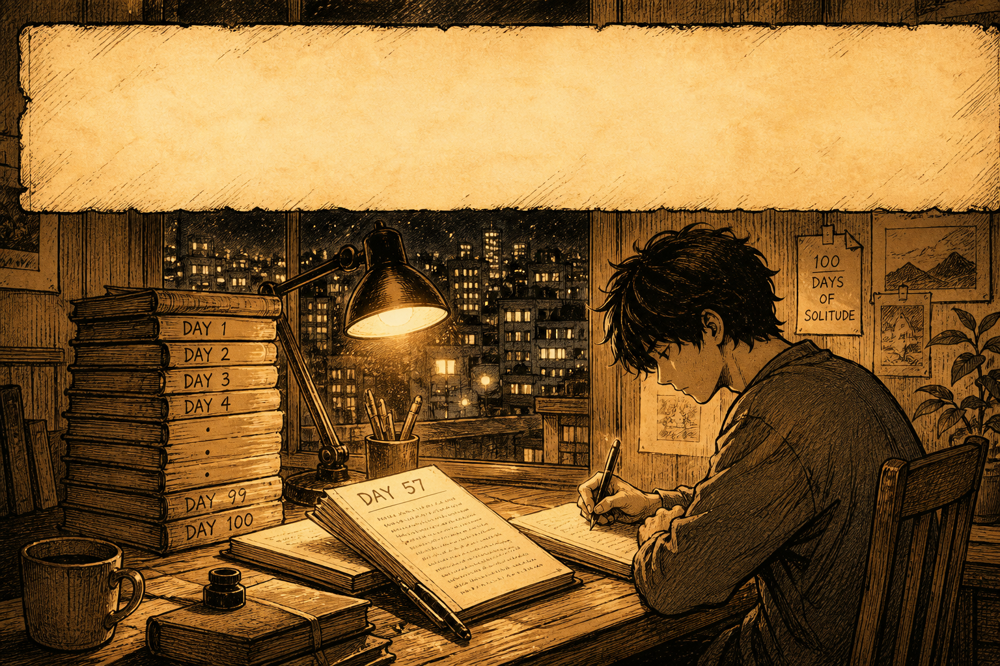
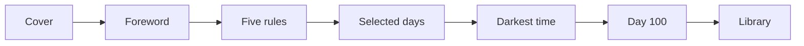
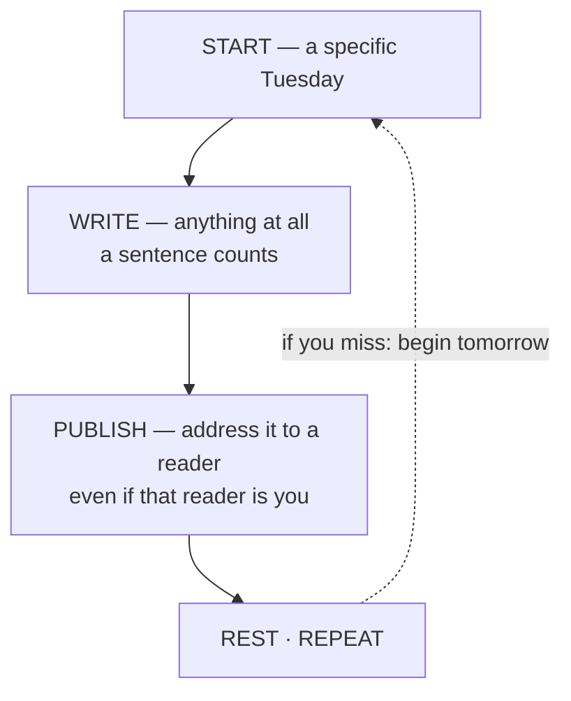

<p align="center">
  
</p>

# 100 Days of Solitude

**An illustrated travelogue — a Thai anthropologist writes himself one hundred days between Shanghai and the Yangtze.**

[](LICENSE)
[](index.html)

By [Dr Non Arkaraprasertkul](https://github.com/Nonarkara) — the book signs itself *Non*. Published by **NON·ISM PRESS**, Shanghai, 2025.

**Read it live:** [100days.nonarkara.org](https://100days.nonarkara.org) · [solitude.nonarkara.org](https://solitude.nonarkara.org)

This is independent studio literature. It is not a government product, not a productivity app, and not a scrape of a private diary.

---

## What this is

The cover calls it *an illustrated travelogue, after the writings of* Non — a Thai anthropologist who, somewhere between his thirties and his typewriter, decided to write himself a hundred days. He had not asked to be alone. Aloneness, like rain on the Yangtze, simply arrived.

This repository **is** the book: one file, [`index.html`](index.html), with the text, the inline SVG plates, the parchment styles, and the butterfly page-flip. There is no build step, no package manager, and no application backend. Open the file and read.

The reader is a bound spread on a dark stage. On the cover the book idles with a slow *butterfly-rest* motion. Turning a page is a 3D CSS flip, not a scroll. Thirty-six spreads run from the cover through a map, a small practice for writing a hundred days, twenty-four numbered chapters, a nonism dictionary, the colophon, and a library of other books from the same press.

The colophon says the passages quoted directly come from the writings of *nonharvard*, 2015–2025; the rest is the gentle invention of a fond third person.

It is a literary work first. The code exists so the pages can turn.

**This repo is not:**

- One hundred separate day files. The days are selected evenings arranged as chapters, not a calendar dump.
- The biographical installation at [100daysofnon](https://github.com/Nonarkara/100daysofnon). That is a different public work.
- A source tree of unpublished novels, PII scans, or sibling ebook folders. Those stay out of the public reader.
- A place to look up analytics tokens, env files, or host credentials. None of those belong in this README.

Further public work: [nonarkara.org](https://nonarkara.org).

---

## Philosophy

He did not set out to write a book. He set out to write a day — one Tuesday evening, a specific quality of light on the Huangpu, and the feeling that if he did not write it down tonight he would lose not the evening, but the self who was having it.

The hundred days was an attempt to fire the committee that argues against the project. To write so regularly that the committee got bored and went home. It mostly worked.

The practice did not produce consistency. It produced a **record**. A record has honest bad days in it; consistency is the edited version of a bad day. The difficulty is in sitting down, not in the writing once begun. For a hundred days it was the only appointment he did not cancel.

The five rules, as the book prints them:

| | Rule |
| --- | --- |
| I | Write every day. Not every weekday. *Every* day. |
| II | Publish immediately. No drafts that live only in the drawer. |
| III | Do not delete. The bad ones are also data. |
| IV | No minimum length. A sentence counts. A word counts. |
| V | No theme. Write what the day gives you. |

*Non-ism*, in the book's own dictionary: general abstention — from Latin *non*, “not.” See also: the practice of leaving things alone. *Solitude* is not a punishment but a small territory in which a person may rehearse, in private, the voice he would like to use in public.

The hundred days is not about writing. It is about becoming, incrementally, the kind of person who keeps going. On the hundredth day he wrote about the cup. It was the same cup as day one. He had not broken it.

The hero at the top is the craft, not a title card: a student at the lamp, Day 57 open, the stack from Day 1 to Day 100 at his elbow, the city still going on outside. That is the studio. The parchment is left blank on purpose. The illustration is the HUD.

---

## Ethical use

This book is for **reading, and for starting your own hundred days**. The reader software is MIT so you can study how a page turns. The literary text and the plates are the author's published work; they are not a dataset and they are not a template to republish under your name.

**Do**

- Read the book. Turn the pages slowly, including the dark ones. The foreword asks that of a kind friend.
- Use the five rules on *your* days. Address them to a reader — even if that reader is you. A locked document counts.
- Study the butterfly reader: one HTML file, CSS spreads, local bookmark keys prefixed `100days:`. The continue-reading notice lives in this browser only.
- Keep secrets out of the public tree. Analytics beacons, env files, private capture endpoints, and unpublished drafts do not belong in a learner README.
- Treat sibling NON·ISM PRESS books as their own works: [Ninja Innovation](https://ninja.nonarkara.org), [The Things You Can See Only When You Slow Down](https://slowdown.nonarkara.org), [What I Mean When I Say](https://mean.nonarkara.org), [Reading Dao De Jing with Dr. Non](https://dao.nonarkara.org).

**Do not**

- Reproduce the prose or artwork as a standalone publication without asking the author.
- Invent reviews, blurbs, licenses, or “all rights reserved” lines the book does not print.
- Commit tokens, passwords, spreadsheet IDs, or personal archives. If a change only works by pasting a secret, it does not belong here.
- List unpublished notes in this tree as part of the published ebook. The public book is `index.html`.
- Treat the darkest pages as spectacle, or as a prompt to extract a private life.
- Overlay titles, badges, or HUD chrome on the hero banner. The illustration is the HUD.

If you need a text license beyond reading and study, ask. Do not invent one.

---

## How to read the days

The days in this book are **selected evenings**, not a folder of Day 01…Day 100. Chapter I is Day 1 beside the Huangpu. Later chapters skip, double back, and — after the hundredth day — continue: the coming-back is Day 108. Read them in spread order. The contents drawer is the map.



The practice itself, as the book diagrams it:



Start today. Not Monday. Not January. The ceremony of a proper beginning is the first thing the committee uses to stop you. If you miss a day, begin again tomorrow. Count it as data.

### Open the book

The book is `index.html`. Display type is loaded from [Google Fonts](https://fonts.google.com/) (Cormorant Garamond, EB Garamond, Caveat, Josefin Sans); system serif and sans fallbacks are declared if those requests fail.

```sh
# from this directory
open index.html          # macOS
xdg-open index.html      # Linux
start index.html         # Windows
```

Or double-click `index.html`. Optional local HTTP origin (useful if a browser restricts `file://` storage):

```sh
python3 -m http.server 8000
```

Then visit [http://localhost:8000/](http://localhost:8000/). No install, no `npm`, no compile. A static host that can serve `index.html` is enough. [`_headers`](_headers) tells Cloudflare Pages not to cache the HTML document, so a new spread is not stuck behind an old page.

### Page-flip

| Control | Action |
| --- | --- |
| Click the right half of the stage, or the right edge | Next spread |
| Click the left half of the stage, or the left edge | Previous spread |
| `→` `↓` `Space` | Next spread |
| `←` `↑` | Previous spread |
| Swipe left / right | Next / previous (touch) |
| Menu button (top left) | Table of contents |
| `Esc` | Close the contents drawer |

On a narrow screen the reader shows one page of the spread at a time (the prose side, with a few left-page exceptions). If you have been here before, a *continue reading* notice may appear on the cover. Last spread and a short visited-spread list stay in this browser, under keys prefixed `100days:`. Nothing is sent to a server for that.

### Spreads

Thirty-six spreads, in the order of the contents drawer:

0. Cover
1. Foreword — On a small life carefully lived
2. A map of the wandering
3. Why This Exists
4. The Practice
5. Your 100 Days — A Framework
6. I. By the bank of the Huangpu
7. II. Of his coffee addiction
8. III. On Death, and his father's flask
9. IV. Why he (gave up) love
10. V. On riding a train
11. VI. Writing by the Yangtze
12. VII. A bicycle technician in bad faith
13. VIII. Forty-four books, more or less
14. IX. His butterfly dream
15. X. On loneliness
16. XI. A corner café, mid-afternoon
17. XII. Kodawari, or, the long pursuit
18. XIII. A boat, mid-river
19. XIV. The power of now, told by a cicada
20. An interlude — Rain in the city
21. — Interruption —
22. XV. The saddest sonnet
23. How he got out of the darkest time
24. XVI. One small return
25. XVII. An accidental minimalist
26. XVIII. Home is where the heart is
27. XIX. A small roof, a small moon
28. XX. The discipline of small things
29. XXI. On freedom
30. XXII. A small nonism dictionary
31. XXIII. What he knows for sure
32. XXIV. The hundredth day
33. Afterword & Colophon
34. — FIN —
35. The Library — more from Non

### Files in this public tree

| File | Role |
| --- | --- |
| [`index.html`](index.html) | The book: text, inline SVG plates, styles, and reader script |
| [`docs/hero-banner.png`](docs/hero-banner.png) | README hero — illustration only, no overlay HUD |
| [`_headers`](_headers) | Cloudflare Pages cache rules (HTML is not cached) |
| [`LICENSE`](LICENSE) | MIT license for the reader software |
| [`README.md`](README.md) | This file |

Illustrations inside the book are inline SVG in `index.html` (cover figure, butterfly, practice diagram).

---

## License

The **reader software** in this repository — the HTML, CSS, and JavaScript that stage the book, flip the pages, open the contents drawer, and remember a place — is licensed under the [MIT License](LICENSE).

The book files do **not** include a separate license grant for the literary text or the illustrations. Those remain the author’s published work. Reading the book here, or studying how the reader is built, is the intended use. Reproducing the text or artwork as a standalone publication is a different question; ask the author if you need that.

Typefaces are loaded from Google Fonts under their own licenses (SIL Open Font License for the families named above). They are not part of this repository.
